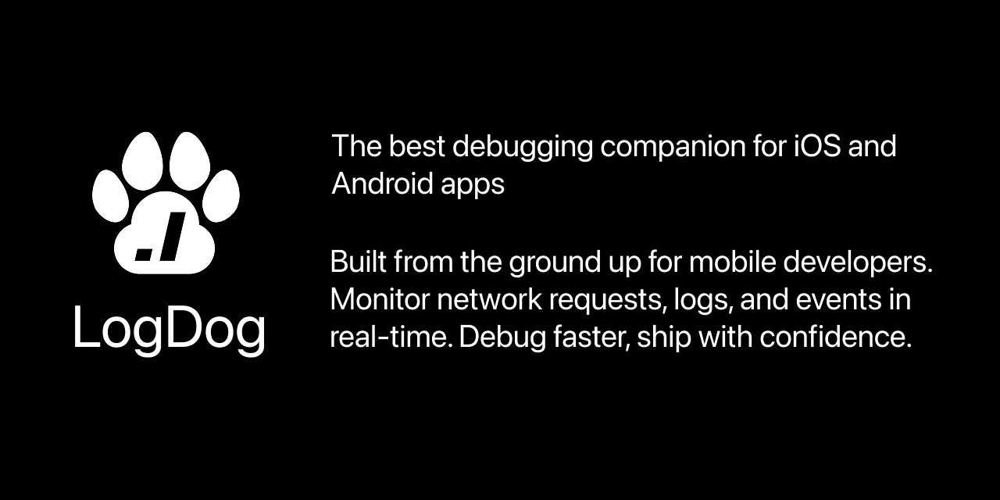

# LogDog for Android (Version: 1.0.53)

LogDog is a powerful logging and monitoring SDK for Android applications that helps you track network requests, events, logs, and analytics in real-time.

## Documentation

For complete documentation, visit the [LogDog Documentation Portal](https://docs.logdog.app).

## Features

- **Network Monitoring**: Automatically capture OkHttp requests and responses
- **Event Tracking**: Log custom events with detailed metadata
- **Firebase Analytics Integration**: Seamlessly capture Firebase Analytics events
- **Log Collection**: Capture application logs across different log levels
- **Real-time Dashboard**: View all captured data in the LogDog dashboard
- **Minimal Performance Impact**: Designed for efficiency with minimal overhead

## Installation

Add the following to settings.gradle.kts (project root).

These instructions apply for apps using .kts gradle files.

```gradle

pluginManagement {
    repositories {
        maven {
            url = uri("https://android-sdk.logdog.app")
        }
    }
}

dependencyResolutionManagement {
    repositories {
        maven {
            url = uri("https://android-sdk.logdog.app")
        }
    }
}
```

Add the LogDog dependency to your app's `build.gradle` (module) file:

```gradle
plugins {
    id("com.modrena.logdog.plugin") version "1.0.53" // Dont forget to set the desired version
}

dependencies {
    implementation("com.modrena.logdog:logdog-sdk:1.0.53") // Dont forget to set the desired version
}
```

## Quick Start

1. Initialize LogDog in your Application class:

```kotlin

import com.modrena.logdog.LogDog
import com.modrena.logdog.LogDogConfig

class MyApplication : Application() {
    override fun onCreate() {
        super.onCreate()
        LogDog.initialize(this) // Needs to be in the onCreate()
        val config = LogDogConfig(apiKey:"YOUR_API_KEY",logs = true, network = true, events = true)
        LogDog.start(config)
        LogDog.i("LogDog","Hello from LogDog!")
    }
}
```


2. Log events:

```kotlin
// Log a simple event
LogDog.logEvent("button_click", mapOf("button_id" to "login_button"))

// Log with different levels
LogDog.d("Debug message")
LogDog.i("Info message")
LogDog.w("Warning message")
LogDog.e("Error message", exception)
```

## Advanced Configuration

```kotlin
val config = LogDogConfig(
    apiKey = "YOUR_API_KEY",
    logs = true,
    network = true,
    firebaseAnalytics = true,
    logLevel = LogLevel.DEBUG,
)

LogDog.start(config)
```